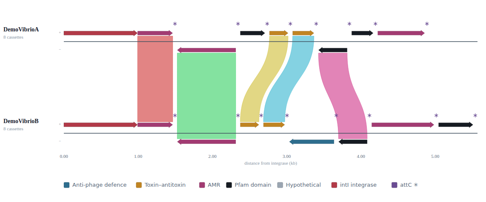
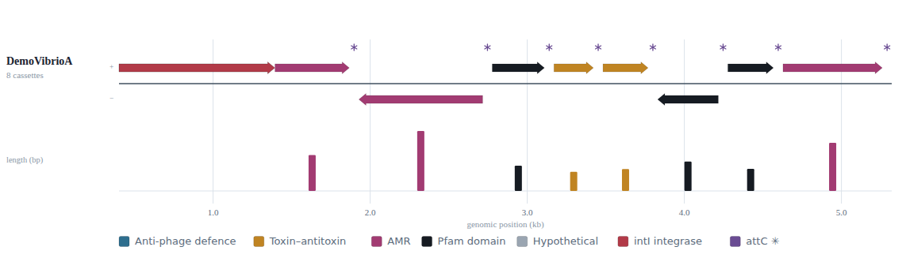

# intervis

**Interactive integron array visualiser.** Give it a genome (it runs IntegronFinder for
you) or an existing IntegronFinder `.integrons` file, and it renders a self-contained,
interactive HTML figure of the cassette array — pan/zoom, cassette arrows coloured by
function, attC sites, gene-name labels, and, for a two-genome comparison, homology
ribbons linking shared cassettes with exact per-pair identity.

Built for the SCIE3220 project on integron cassette arrays in *Vibrio* and other genomes.

<p align="center">
  <br>
  <em>Comparison view — two arrays aligned at the integrase, homologous cassettes joined by ribbons.</em>
</p>
<p align="center">
  <br>
  <em>Single-array view — forward/reverse strands, attC sites, function colours, gene labels.</em>
</p>

---

## What it is

intervis is a small **Python engine + command-line tool** with a thin **R/Shiny GUI**
on top:

- **Engine / CLI** (`intervis/`) — runs IntegronFinder, parses the `.integrons`, names
  cassettes (DIAMOND vs Swiss-Prot, plus optional GFF/GenBank gene symbols), clusters
  cassettes across genomes (DIAMOND reciprocal best hits), and emits the interactive
  HTML viewer.
- **GUI** (`app/`) — a Shiny front-end: upload one genome for a single-array view or two
  to compare, or pick a bundled example. It shells out to the same CLI, so the web tool
  and the command line never drift apart.

The viewer itself is one self-contained HTML file — no server, no internet — so any
figure it produces can be opened, shared, or exported (SVG / PNG / PDF) on its own.

## How it works

```
genome.fna ──▶ IntegronFinder ──▶ .integrons ──▶ parse (orient integrase-left,
                (--local-max            │          classify cassettes)
                 --keep-palindromes)    │
                                        ▼
                        annotate (DIAMOND vs Swiss-Prot gene names;
                                  optional GFF/GenBank symbols by coordinate)
                                        │
                     ┌──────────────────┴───────────────────┐
                     ▼ (1 genome)                            ▼ (2 genomes)
             single-array viewer               cluster cassettes across genomes
             (cartographer.html)               (DIAMOND reciprocal best hits)
                                                            │
                                                            ▼
                                               comparison viewer with ribbons
                                                        (synteny.html)
```

`intervis view` and `intervis compare` work straight from `.integrons` files with **no
IntegronFinder needed**, so they are instant — IntegronFinder is the only slow step and
only `intervis run` invokes it.

## Requirements

- **Python** ≥ 3.9 (the engine is standard-library only)
- **[IntegronFinder](https://github.com/gem-pasteur/Integron_Finder)** ≥ 2.0.2 on `PATH` — needed only to go from a genome to `.integrons`
- **[DIAMOND](https://github.com/bbuchfink/diamond)** ≥ 2.1 on `PATH` — needed for cassette naming and cross-genome ribbons
- **R** ≥ 4.1 with the **shiny** package — needed only for the GUI

## Install

```bash
# 1. the bioinformatics env (IntegronFinder + DIAMOND + Python)
micromamba create -f environment.yml      # or: conda env create -f environment.yml
micromamba activate integronfinder

# 2. the intervis CLI
pip install -e .                           # from this folder
```

For cassette naming, build a Swiss-Prot DIAMOND database once and point `--swissprot` at
it (or set `INTERVIS_SWISSPROT`):

```bash
diamond makedb --in uniprot_sprot.fasta -d db/swissprot
```

## Command-line use

```bash
# genome in -> interactive figure out (runs IntegronFinder, then renders)
intervis run genome.fna -o genome.html --cpu 8 --annotate --swissprot db/swissprot

# render straight from an existing .integrons (instant)
intervis view N16961.integrons --genome N16961.fna -o N16961.html

# pairwise comparison with real homology ribbons (the web tool caps at 2; the CLI allows more)
intervis compare A.integrons B.integrons --genomes A.fna B.fna -o comparison.html
```

Optional gene-name annotation from a matching GFF3/GenBank: add `--annotation genome.gff`
(single) or `--annotations A.gff B.gff` (compare). A matching `.gff`/`.gbff` sitting next
to the FASTA is picked up automatically.

## The Shiny app

```bash
micromamba activate integronfinder        # so integron_finder, diamond, python are on PATH
R -e 'shiny::runApp("app", host="0.0.0.0", port=8787, launch.browser=FALSE)'
```

Then open the forwarded port in a browser. Pick a bundled **Example** (instant) to see a
result immediately, or upload your own genome (FASTA) — with an optional GFF/GenBank for
gene names — and press **Run**. A precomputed `.integrons` renders instantly; a genome
runs the full IntegronFinder pipeline (minutes).

Config is via environment variables (or the defaults at the top of `app/app.R`):
`INTERVIS_PKG`, `INTERVIS_SWISSPROT`, `INTERVIS_CPU`.

## Bundled examples

`app/examples/` ships two small **synthetic demos** (`DemoVibrioA` / `DemoVibrioB`) that
load instantly and demonstrate both views (their comparison shows five homology ribbons,
one below 100 % so the identity gradient is visible). The app **auto-discovers** anything
in that folder at launch — no manifest — so added examples survive upgrades.

Two helper scripts (run inside the env):

```bash
# fetch real Vibrionaceae superintegron genomes from NCBI and build them as examples
cd app/examples && ./fetch_examples.sh

# register one of your own genomes as an example (precomputes its .integrons)
./add_example.sh <id> <genome.fna> [annotation.gff|.gbff]
```

`fetch_examples.sh` keeps a genome only if IntegronFinder finds a *complete* integron
(integrase + a real attC array), so every example is directly comparable. Downloaded
genomes are git-ignored; only the small demos are committed.

## Running on an HPC (Bunya)

The app needs IntegronFinder/DIAMOND/Python, so it runs on a compute node, not a hosted
Shiny service. Grab an interactive allocation, launch the app there, and tunnel to it:

```bash
# on the login node
salloc --account=<account> --partition=general --nodes=1 --ntasks=1 \
       --cpus-per-task=8 --mem=32G --time=04:00:00 --job-name=intervis
srun --export=ALL --pty bash -l
hostname                                   # note the node, e.g. bun137

micromamba activate integronfinder
R -e 'shiny::runApp("app", host="0.0.0.0", port=8787, launch.browser=FALSE)'
```

```bash
# from your laptop (swap in the node name)
ssh -N -L 8787:bun137:8787 <user>@bunya.rcc.uq.edu.au
# then open http://localhost:8787
```

## Repository layout

```
intervis/
├── intervis/            # Python engine + CLI (stdlib only)
│   ├── cli.py           #   run | view | compare
│   ├── engine.py        #   IntegronFinder wrapper, .integrons parser, HTML builder
│   ├── annotate.py      #   cassette naming (DIAMOND / Swiss-Prot; GFF/GenBank symbols)
│   ├── cluster.py       #   cross-genome cassette clustering (DIAMOND reciprocal best hits)
│   └── templates/       #   cartographer.html (single) · synteny.html (compare)
├── app/                 # R/Shiny GUI
│   ├── app.R
│   └── examples/        #   synthetic demos + fetch_examples.sh / add_example.sh
├── environment.yml      # conda/micromamba env (IntegronFinder + DIAMOND + Python)
├── pyproject.toml
└── docs/                # screenshots
```

## Roadmap

- **Done** — genome/`.integrons` → interactive single + comparison viewers; cassette
  naming (Swiss-Prot + optional GFF/GenBank symbols); cross-genome homology ribbons with
  exact identity; bundled examples; the Shiny GUI.
- **Next** — wrap the GUI as a formal, installable R Shiny package.
- **Later** — population-scale cassette context (LexicMap / AllTheBacteria) as a CLI feature.

## Acknowledgements

intervis stands on [IntegronFinder](https://github.com/gem-pasteur/Integron_Finder) (Néron
*et al.*) for integron detection and [DIAMOND](https://github.com/bbuchfink/diamond)
(Buchfink *et al.*) for protein clustering, and its comparison view is inspired by
[clinker](https://github.com/gamcil/clinker) (Gilchrist & Chooi).

## License

[MIT](LICENSE) © 2026 Liam Nguyen.

## Citing intervis

If intervis is useful in your work, please cite it (and IntegronFinder and DIAMOND).
A suggested form:

> Nguyen, L. (2026). *intervis: an interactive integron array visualiser.* SCIE3220.
> https://github.com/<your-username>/intervis
